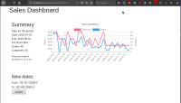
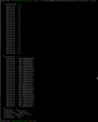
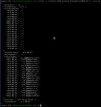
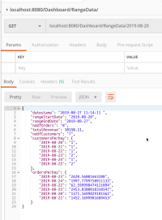

# Sales Dashboard

A quick challenge to implement a Sales Dashboard in PHP without any frameworks. The entire thing was time-boxed and done over a weekend.

There are two main components in the code

- TinyMVC, a custom MVC framework built from scratch
- Sales Dashboard, a sample application utilizing the framework

## Features

### The framework, TinyMVC

---

- PSR-4 compliant [AutoLoader](./src/TinyMVC/PSR4AutoLoader.php) loading applcation and framework from differnt directories.
- Each controller has a set of actions. Each action has one view (only one) and any number of models.
- Controller acts a as middleman between the model(s) and view (V->C->M->C->C)
- Support and handle HTTP responses: 200. 404, 500
- All directory names can be configured by the developer.
- Debug Mode generating raw output
- The root View (extended by all views) loads .html file by default. Subclasses can rely on that or customize their own. This makes simple pages require only .html.
- No need to handle erro 500 within controllers, it's taken care of in the bootstraper.

### The application, Sales Dashboard

- The application servers both HTML UI and JSON API.
- Using Bootstrap
- Native JS, no JQuery, ...

[](./docs/ui.png)
[](./docs/range1.png)
[](./docs/range2.png)
[](./docs/postman.p)

## Software design and archtecture

You can read more about how this was develop in the [decision log](docs/decision-log.md)

## Requirements

To run the application the following toosl are needed

- GNU Make
- Docker
- Docker-compose

## Installation

The fastest way to run the application is by using `Docker-compose`. But to make things easy there is a `Makefile` which contain tasks to speed up things. Once you run the app, dummy data will be loaded automatically for demo purposes

After installing Docker & Docker-compose execute the following:

```bash
# Build images and run all needed containers
make up
# shutdown the containers and remove then
make down
```

P.S: All scripts are tested on Linux. In theory, they should run on other platforms but they are not tested.

The only valid routes are

- `/Dashbaord/RangeData/yyyy-mm-dd/yyyy-mm-dd`: sales data `from/to`
- `/Dashbaord/RangeData/yyyy-mm-dd` : no `to` date, defaulting to today
- `/Dashbaord/RangeData` : no `from/to` dates, defaulting for the last x days (x is configurable but defaulting to 30 days)
